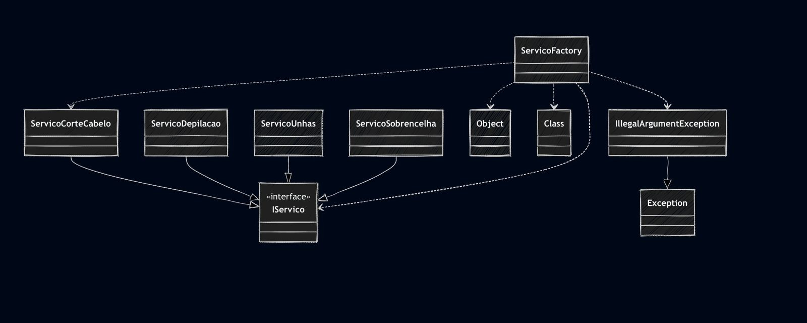

# 💇‍♀️ Sistema de Serviços de Beleza

Este projeto implementa e testa diferentes tipos de **serviços de beleza**, utilizando **Java** e **JUnit** para validação.  
O objetivo é simular serviços como **corte de cabelo, depilação, sobrancelha e unhas**, além de aplicar o **Factory Pattern** para a criação flexível e escalável dos serviços.

---

## 📂 Estrutura do Projeto

📌 Classes de Testes:
- ✂️ **`ServicoCorteTest.java`** → Testes do serviço de corte de cabelo  
- 🪒 **`ServicoDepilacaoTest.java`** → Testes do serviço de depilação  
- 🏭 **`ServicoFactoryTest.java`** → Testes do padrão *Factory* para criação de serviços  
- 👁️ **`ServicoSobrancelhaTest.java`** → Testes do serviço de sobrancelha  
- 💅 **`ServicoUnhasTest.java`** → Testes do serviço de unhas  

---

## 🛠️ Tecnologias Utilizadas

- ☕ **Java 11+**  
- 🧪 **JUnit 5** (para os testes unitários)  
- 📦 **Maven** ou **Gradle** (para gerenciamento do projeto e execução dos testes)  

---

## 📌 Diagrama de Classes

---

## 👩‍💻 Autora

**Eduarda Araujo Carvalho**  
