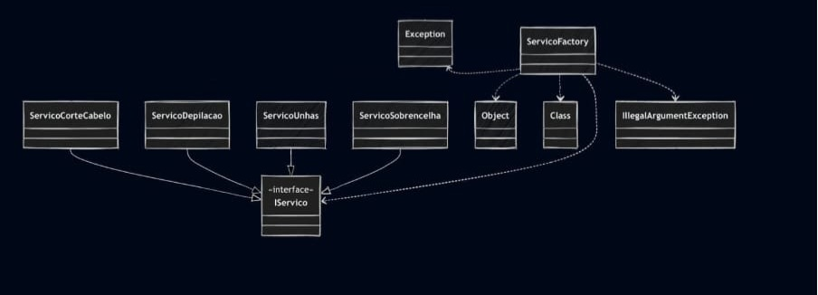

# 💇‍♀️ Sistema de Agendamento de Serviços de Beleza

Este projeto implementa e testa diferentes tipos de agendamento de **serviços de beleza**, utilizando **Java** e **JUnit** para validação.  
O objetivo é simular o agendamento de serviços como **corte de cabelo, depilação, sobrancelha e unhas**, além de aplicar o **Factory Pattern** para a criação flexível e escalável dos serviços.

---
## 📌 Diagrama de Classes

---

## 👩‍💻 Autora

**Eduarda Araujo Carvalho**  
